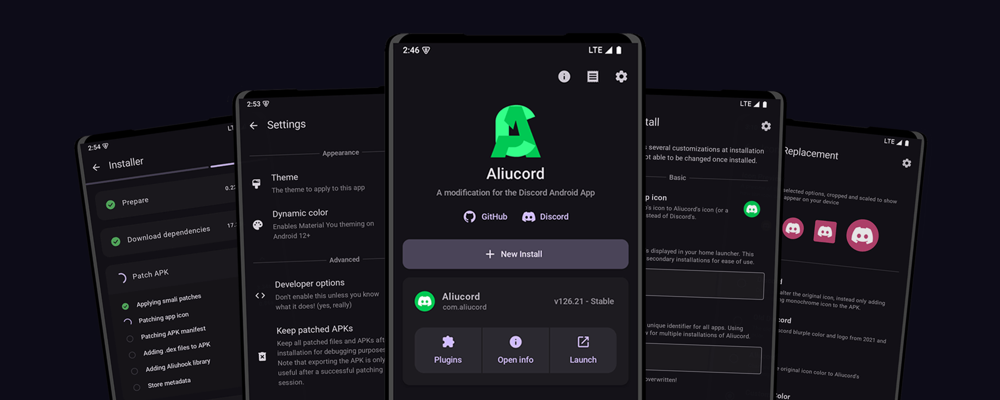

<div align="center">
    
    <h1>Aliucord Manager</h1>
    <p>The new method to install Aliucord, in a user-friendly way.</p>

[](https://discord.gg/EsNDvBaHVU)
[](https://github.com/Aliucord/Manager/stargazers)
[](https://nightly.link/Aliucord/Manager/workflows/android/main/app.zip)


[](https://github.com/Aliucord/Manager/blob/main/LICENSE)

</div>

## Prerequisites

Supported Android versions:

- Android 7 (SDK 24) - Android 16 QPR1 (SDK 36)
- Architectures: arm64, armeabi-v7, x86_64, x86

If you have already installed Aliucord before via the old installer app, you can uninstall the
legacy installer. It is deprecated and does not work anymore.

## Installation

1. Download the [latest release APK](https://github.com/Aliucord/Manager/releases/latest)
2. Open and install Aliucord Manager
    - If you have not enabled "Install from unknown sources" for your browser via system settings, do so now.
3. Open Aliucord Manager
4. Grant the permission requests
5. Click "New Install"
    - You may change how the Aliucord app icon will look once installed.
6. Click "Install" and wait. Do not exit the app while it is running.
    - If a failure occurs, it may be due to a variety of reasons:
        - Poor internet connection
        - Internet censorship / blocks (use a VPN or a different DNS server)
        - Insufficient free storage (at least 500MB is recommended)
    - If you are stuck, please ask for help in the `#support` channel of our [Discord](https://discord.gg/EsNDvBaHVU0).
7. Click "Launch" or directly launch the newly installed Aliucord app
8. Grant the permission requests
9. Sign in to Discord
10. Install plugins by following these [instructions](https://github.com/aliucord/aliucord#-plugin-installation)

## Building

1. Install the prerequisites:
    - Git
    - [JDK 21+](https://adoptium.net/temurin/releases/?os=any&arch=any&version=21)
2. Clone the repo:
   ```shell
   git clone https://github.com/rushiiMachine/Manager && cd Manager
   ```
3. Build the project:
   #### Linux/macOS
   ```shell
   chmod +x gradlew && ./gradlew :app:packageStaging --stacktrace
   ```
   #### Windows
   ```shell
   .\gradlew.bat app:assembleDebug
   ```
4. Built APK will be located at `./app/build/outputs/apk/staging/app-staging.apk`

## Translations

This project handles crowd-sourced translations through Crowdin! If you happen to be fluent in one of the languages listed below,
then please feel free to contribute your translations!

[](https://crowdin.com/project/aliucord-manager)
<br/><br/>
[](https://crowdin.com/project/aliucord-manager)
